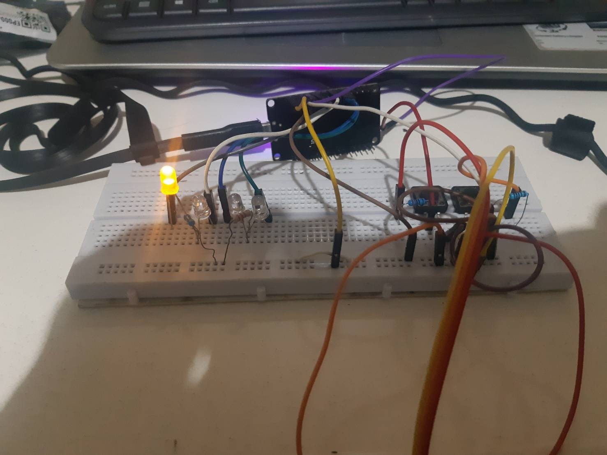
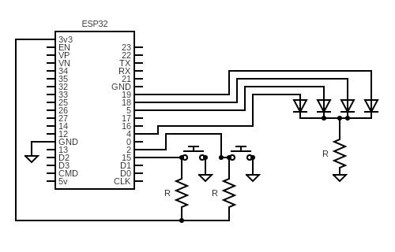

# LAMPU_GESER

## Tugas EL4121   Perancangan Sistem Embedded   Semester 1 - 2022/2023

Nama: Sidartha Prastya. P  
NIM: 13219033  

### Specification:

- 4 LEDs (output)
- 2 push-buttons (input)
- Only 1 LED is turned on at a time
- Press button-1 (left) to turn the left-side LED on
- Press button-2 (right) to turn the right-side LED on
- After the right end, it will jump to the left end
- After the left end, it will jump to the right end

### Microcontroller:
- ESP32 DOIT (Compiled with ESP-IDF)

### Note:
- Push button mode: External pull-up